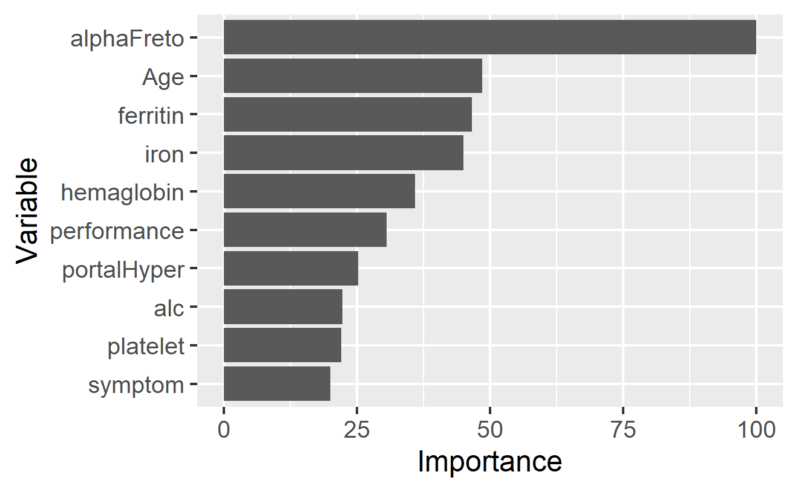

```{r setup, include=FALSE}
knitr::opts_chunk$set(echo = FALSE)
```
  
```{r loadPackages, echo = FALSE, message=FALSE, warning=FALSE}
suppressPackageStartupMessages(library(tidyr))
suppressPackageStartupMessages(library(knitr))
suppressPackageStartupMessages(library(dplyr))
suppressPackageStartupMessages(library(MachineShop))
suppressPackageStartupMessages(library(recipes))
suppressPackageStartupMessages(library(kableExtra))
suppressPackageStartupMessages(library(arsenal))
if(!dir.exists("./vi_cache/")){
  dir.create("./vi_cache/")
}
```  

```{r getData, echo = FALSE, cache=TRUE}
dat <- readRDS("./data/hcc_data.RDS")
# dat <- readRDS("~/Desktop/R practice/Machine learning class spring 2022/hcc-survival/hcc_data.RDS")
rec_base <- recipe(
  status ~ .,
  data = dat
) %>%
 role_case(stratum = status) %>%
  check_missing(status) %>%
  step_num2factor(status, transform = function(x) x + 1,
                  levels = c("died", "survive")) %>%
  step_num2factor(gender, transform = function(x) x + 1,
                  levels = c("female", "male")) %>%
  step_num2factor(symptom, transform = function(x) x + 1,
                  levels = c("no", 'yes')) %>%
  step_num2factor(alc, transform = function(x) x + 1,
                  levels = c("no", 'yes')) %>%
  step_num2factor(hepBsurfAnti,transform = function(x) x + 1,
                  levels = c("no", 'yes')) %>%
  step_num2factor(hepBeAnti,transform = function(x) x + 1,
                  levels = c("no", 'yes')) %>%
  step_num2factor(hepBcorAnti,transform = function(x) x + 1,
                  levels = c("no", 'yes')) %>%
  step_num2factor(hepCvirAnti,transform = function(x) x + 1,
                  levels = c("no", 'yes')) %>%
  step_num2factor(cirr,transform = function(x) x + 1,
                  levels = c("no", 'yes')) %>%
  step_num2factor(endemicCountries,transform = function(x) x + 1,
                  levels = c("no", 'yes')) %>%
  step_num2factor(smoke,transform = function(x) x + 1,
                  levels = c("no", 'yes')) %>%
  step_num2factor(diabetes,transform = function(x) x + 1,
                  levels = c("no", 'yes')) %>%
  step_num2factor(obese,transform = function(x) x + 1,
                  levels = c("no", 'yes')) %>%
  step_num2factor(hemochro,transform = function(x) x + 1,
                  levels = c("no", 'yes')) %>%
  step_num2factor(artHyper,transform = function(x) x + 1,
                  levels = c("no", 'yes')) %>%
  step_num2factor(chronRenal,transform = function(x) x + 1,
                  levels = c("no", 'yes')) %>%
  step_num2factor(hiv,transform = function(x) x + 1,
                  levels = c("no", 'yes')) %>%
  step_num2factor(Nasteato,transform = function(x) x + 1,
                  levels = c("no", 'yes')) %>%
  step_num2factor(esophVarices,transform = function(x) x + 1,
                  levels = c("no", 'yes')) %>%
  step_num2factor(spleno,transform = function(x) x + 1,
                  levels = c("no", 'yes')) %>%
  step_num2factor(portalHyper,transform = function(x) x + 1,
                  levels = c("no", 'yes')) %>%
  step_num2factor(portalVeinThromb,transform = function(x) x + 1,
                  levels = c("no", 'yes')) %>%
  step_num2factor(LiverMeta,transform = function(x) x + 1,
                  levels = c("no", 'yes')) %>%
  step_num2factor(RadioHallmark,transform = function(x) x + 1,
                  levels = c("no", 'yes'))

# %>%
#   step_num2factor(numNodules,transform = function(x) x + 1,
#                   levels = as.character(0:5))
dat2 <- bake(prep(rec_base), new_data = dat)
```

# Background HCC

## HepatoCellular Carcinoma (HCC)

* HepatoCellular Carcinoma (HCC) 6th most frequently diagnosed cancer. 

* Data mining approach to tailor evaluation and treatment for HCC are limited in the literature.

* Using the HCC dataset, we undertook the data mining approach to evaluate the patient level factors to identify those who are at risk of one year mortality. 

# Data Summary

\begin{itemize} 
    \item {Clinical data of 165 pts with HCC (demographic, risk factors, lab data, and survival features)}
    \item {49 features from HCC clinical practice guidelines (Table 1)}
    \item  About 80% male, 74% had alochol related liver disease, 27% had hepatitis B, 21 % had hepatitis C, and 90% had cirrhosis. 
    \item Missing data represents 10.22% of the whole dataset and only eight patients have complete information in all fields (4.85%).
    \item The target variable is the survival at 1 year, coded as 0 (dies) and 1 (lives). 
\end{itemize}

# Data Summary

```{r summary, results='asis', echo = FALSE}
cnm <- colnames(dat2)
tbl <- tableby(
  ~ gender + symptom + alc, data = dat2,
  control = tableby.control(
    cat.stats = c("countpct", "Nmiss"),
    numeric.stats = c("medianrange", "Nmiss"),
    digits = 2
  )
)
summary(tbl, title = 'Table 1. HCC Data Summary') 
```


# Random Forest Model

## Description

* Tree model

* 10 fold CV

* hyperparameters tuned by Bayesian Optimization

* KNN imputation


## Estimated Performance

## Calibration Plots

## Variable Importance

## Partial Dependence

# XGBoost Model

## Description 

Input: training set $\{(x_i, y_i)\}_{i=1}^N$, a differentiable loss function $L(y, F(x))$, a number of weak learners $M$ and a learning rate $\alpha$.  \

\begin{enumerate}
    \item Initialize model with a constant value: $\hat{f}_{(0)}(x) = argmin_{\theta}\sum_{i=1}^N L(y_i, \theta)$.
    \item For $m = 1, ..., M$:
        \begin{itemize}
            \item[a] Compute gradients and hessians:
                $\hat{g}_m(x_i) = \left[\frac{\partial L(y_i, f(x_i))}{\partial f(x_i)}\right]_{f(x) = \hat{f}_{m-1}(x)}$ \\
                $\hat{h}_m(x_i) = \left[\frac{\partial^2 L(y_i, f(x_i))}{\partial f(x_i)^2}\right]_{f(x) = \hat{f}_{m-1}(x)}$.
            \item[b] Fit a base learner using the training set $\bigg\{x_i, -\frac{\hat{g}_m(x_i)}{\hat{h}_m(x_i)}\bigg\}_{i=1}^N$ by solving the optimization problem below: \\
                $\hat{\phi}_m = argmin_{\phi \in \Phi} \sum_{i=1}^N \frac{1}{2}\hat{h}_m(x_i)\left[-\frac{\hat{g}_m(x_i)}{\hat{h}_m(x_i)} - \phi(x_i)\right]^2$.
            \item[c] Update the model: $\hat{f}_m(x) = \hat{f}_{(m-1)}(x) + \alpha \hat{\phi}_m$. 
        \end{itemize}
    \item Output $\hat{f}(x) = \hat{f}_{(M)}(x)$.
\end{enumerate}

## Description 

* Tuning parameters: number of boosting iterations $M$, shrinkage of variable weights at each iteration to prevent overfitting $\eta$, maximum tree depth. 

* Tuning inputs: KNN with the number of neighbors, correlation among variables, principal component analysis proportion of variance to be retained. 

* XGBoost includes different regularization penalties to prevent overfitting. It can be run on multiple CPU cores and servers to save training time. 

## Estimated Performance 

```{r xgboost estimated performance, cache=TRUE}
# res_knn_none <- readRDS("./data/ModelCache/knn_none_xgboost_res.RDS")
# res_knn_corr <- readRDS("./data/ModelCache/knn_corr_xgboost_res.RDS")
# res_knn_pca <- readRDS("./data/ModelCache/knn_pca_xgboost_res.RDS")
# res_meanmode_none <- readRDS("./data/ModelCache/MeanMode_none_xgboost_res.RDS")
# res_meanmode_corr <- readRDS("./data/ModelCache/MeanMode_corr_xgboost_res.RDS")
# res_meanmode_pca <- readRDS("./data/ModelCache/MeanMode_pca_xgboost_res.RDS")
# 
# # res_knn_none <- readRDS("H:/BIOS_6720/Project_YL/knn_none_xgboost_res.RDS")
# # res_knn_corr <- readRDS("H:/BIOS_6720/Project_YL/knn_corr_xgboost_res.RDS")
# # res_knn_pca <- readRDS("H:/BIOS_6720/Project_YL/knn_pca_xgboost_res.RDS")
# # res_meanmode_none <- readRDS("H:/BIOS_6720/Project_YL/MeanMode_none_xgboost_res.RDS")
# # res_meanmode_corr <- readRDS("H:/BIOS_6720/Project_YL/MeanMode_corr_xgboost_res.RDS")
# # res_meanmode_pca <- readRDS("H:/BIOS_6720/Project_YL/MeanMode_pca_xgboost_res.RDS")
# # 
# res <- c(KNN_none = res_knn_none,
#          KNN_corr = res_knn_corr,
#          KNN_pca = res_knn_pca,
#          MeanMode_none = res_meanmode_none,
#          MeanMode_corr = res_meanmode_corr,
#          MeanMode_pca = res_meanmode_pca
# )
# res_sum <- summary(res)
# res_mean_sum <- cbind(res_sum[, , Metric = "Brier"][, 1],
#       res_sum[, , Metric = "Accuracy"][, 1],
#       res_sum[, , Metric = "Kappa"][, 1],
#       res_sum[, , Metric = "ROC AUC"][, 1],
#       res_sum[, , Metric = "Sensitivity"][, 1],
#       res_sum[, , Metric = "Specificity"][, 1])
# colnames(res_mean_sum) <- c("Brier", "Accuracy", "Kappa", "ROC AUC",
#                             "Sensitivity", "Specificity")
# kable(res_mean_sum)
```

```{r}
res_knn_corr <- readRDS("./data/ModelCache/knn_corr_xgboost_res.RDS")
# res_knn_corr <- readRDS("H:/BIOS_6720/Project_YL/knn_corr_xgboost_res.RDS")

sres_knn_corr <- as.data.frame(summary(res_knn_corr))

sres_knn_corr <- as.data.frame(sres_knn_corr) %>%
  pivot_wider(names_from = Statistic, values_from = Value) 

sres_knn_corr %>% kable(caption = "XGBoost results with knn imputation and feature selection using correlation",
        digits = 3) %>%
  kable_styling(full_width = FALSE)
```

* Tried six models with different combinations of imputatin methods and feature selection methods. All models are not doing well for specificity.

* KNN_corr appears to do better among models for its highest accuracy and kappa, second highest sensitivity and specificity, reasonable brier and roc auc.

* P-values are not significant. 

```{r xgboost estiamted performance plot}
# plot(res)
```

```{r xgboost estiamted performance t.test, echo = FALSE}
# t.test(diff(res))
```

## Calibration Plots

```{r out.height="70%", out.width="70%", fig.align='center', results='hide'}
knn_corr_fit <- readRDS("./data/ModelCache/knn_corr_xgboost_fit.RDS")
# knn_corr_fit <- readRDS("H:/BIOS_6720/Project_YL/knn_corr_xgboost_fit.RDS")

# ## In-sample calibration
# obs <- response(knn_corr_fit)
# pred <- predict(knn_corr_fit)
# cal_in <- calibration(obs, pred)
# plot(cal_in, se = TRUE)

## Out-of-sample calibration (resample estimation)
cal_out <- calibration(res_knn_corr)
plot(cal_out, se = TRUE)

## Smoothed curve
cal <- calibration(res_knn_corr, breaks = NULL)
plot(cal, se = TRUE)
```

* Some fluctuations. Smoothed calibration curve shows false negatives on the low left part and some false positives on the upper right part. This is consistent to the low specificity and high sensitivity of the model. 

## Variable Importance

```{r warning=FALSE, out.width="80%", out.height="80%", fig.align='center', cache = TRUE}
# variable importance
# set.seed(123123)
# plot(varimp(knn_corr_fit), n = 10) 

```

## Variable Importance 

## Partial Dependence: alphaFreto 

```{r results='hide'}
pd <- dependence(knn_corr_fit, select = c(alphaFreto))
plot(pd)
```

## Partial Dependence: Age 

```{r results='hide'}
pd <- dependence(knn_corr_fit, select = c(Age))
plot(pd)
```

## Partial Dependence: ferritin 

```{r results='hide'}
pd <- dependence(knn_corr_fit, select = c(ferritin))
plot(pd)
```

## Partial Dependence: iron 

```{r results='hide'}
pd <- dependence(knn_corr_fit, select = c(iron))
plot(pd)
```

## Partial Dependence: hemaglobin 

```{r results='hide'}
pd <- dependence(knn_corr_fit, select = c(hemaglobin ))
plot(pd)
```

# Support Vector Machine Model

## Description

```{r, cache = TRUE}
fit_jt <- readRDS("./data/ModelCache/knn_none_SVMRad_fit.RDS")
sfit <- summary(as.MLModel(fit_jt))
hyperparam <- Reduce(cbind, sfit$TrainingStep1$params[sfit$TrainingStep1$selected,])

```


* A support vector machine attempts to draw a non-linear boundary to classify the outcome by transforming the predictors using basis functions

* In this transformed space, find linear boundaries using support vector classifier.

* We just need to know the kernel function on the basis functions, don't need to know basis function itself. 

* Radial Basis kernel function: $\exp(-\sigma^2\Vert x - x' \Vert^2)$; $\sigma =$ `r hyperparam$sigma`

* Cost of misclassification C =`r hyperparam$C`

* imputation using knn with neighbors = 4


## Estimated Performance

```{r, cache = TRUE}
resamp_jt <- readRDS("./data/ModelCache/knn_none_SVMRad_res.RDS")
sres_jt <- as.data.frame(summary(resamp_jt))
as.data.frame(sres_jt) %>% 
  pivot_wider(names_from = Statistic, values_from = Value) %>%
  kable(caption = "SVMRad results with knn imputation",
        digits = 3) %>%
  kable_styling(full_width = FALSE)
```


## Calibration Plots

```{r out.height="70%", out.width="70%", fig.align='center', results='hide'}
plot(calibration(resamp_jt))
```

* Decently calibrated. Low probabilities have many false negatives.

## Variable Importance

```{r warning=FALSE, out.width="80%", out.height="80%", fig.align='center', cache = TRUE}
set.seed(123123)
if(file.exists("./vi_cache/knn_none_SVMRad_vi.RDS")){
  vi_jt <- readRDS("./vi_cache/knn_none_SVMRad_vi.RDS")
}else{
  vi_jt <- varimp(fit_jt)
  saveRDS(vi_jt, "./vi_cache/knn_none_SVMRad_vi.RDS")
}
plot(vi_jt, n=15)
```

## Variable Importance

\begin{itemize}
  \item { Symptoms (performance)}

  \item { Indicators of liver injury/disease/infection (hepBsurfAnti, hepCvirAnti,aspartateTransaminase, alkalinePhosphatase, ferritin, totalProteins, ascites, hemoglobin)}

  \item { Biological Characteristics (age, portalVeinThromb)}

  \item { Risk factors (diabetes, artHyper)}
  
  \item {behavioral/demographic (endemicCountries, cigPerYr)}
\end{itemize}


## Partial Dependence: diabetes

```{r results='hide'}
pd <- dependence(fit_jt, select = c(diabetes))
plot(pd)
```

## Partial Dependence: ferritin

```{r results='hide'}
pd <- dependence(fit_jt, select = c(ferritin))
plot(pd)
```


## Partial Dependence ascites

```{r results='hide'}
pd <- dependence(fit_jt, select = c(ascites))
plot(pd)
```

## Partial Dependence: artHyper

```{r results='hide'}
pd <- dependence(fit_jt, select = c(hepCvirAnti))
plot(pd)
```


## Partial Dependence: symptom

```{r, warning=FALSE, results='hide'}
pd <- dependence(fit_jt, select = c(artHyper))
plot(pd)
```

# Final Model

* Final model was chosen by the model with the highest Sensitivity - 2SD

# References {.allowframebreaks}